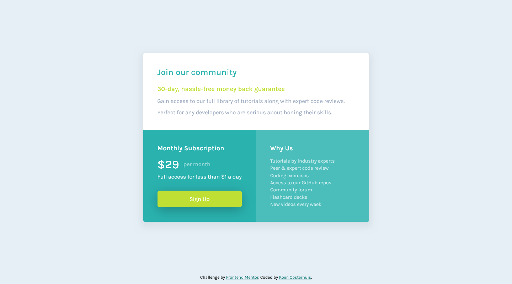

# Frontend Mentor - Single price grid component solution

This is a solution to the [Single price grid component challenge on Frontend Mentor](https://www.frontendmentor.io/challenges/single-price-grid-component-5ce41129d0ff452fec5abbbc). Frontend Mentor challenges help you improve your coding skills by building realistic projects. 

## Table of contents

- [Overview](#overview)
  - [The challenge](#the-challenge)
  - [Screenshot](#screenshot)
  - [Links](#links)
- [My process](#my-process)
  - [Built with](#built-with)
  - [What I learned](#what-i-learned)
  - [Continued development](#continued-development)
- [Author](#author)
- [Acknowledgments](#acknowledgments)

**Note: Delete this note and update the table of contents based on what sections you keep.**

## Overview

### The challenge

Users should be able to:

- View the optimal layout for the component depending on their device's screen size
- See a hover state on desktop for the Sign Up call-to-action

### Screenshot

### Links

- Solution URL: [Link](https://github.com/koeno100/single-price-grid-component)
- Live Site URL: [Link](https://koeno100.github.io/single-price-grid-component/)

## My process

### Built with

- Semantic HTML5 markup
- Flexbox
- CSS Grid
- Mobile-first workflow

### What I learned

This challenge was a little difficult to start with, because I had never worked with the grid before. After looking a little through Yoseph Winata's solution, I realised that I only needed the grid in the desktop version, in the mobile version I could just structure everything as is, because the different blocks of elements would position below each other anyways. Switching from the mobile design to the desktop design proved to be fairly simple: I only had to rearrange the blocks using grid and adjust some padding and other measurements and it was good to go!

On top of that, I tried to be efficient with class naming, using my classes in such a way that I could use the same class for multiple elements. On top of that, I'm starting to get an idea of how to apply semantic HTML, and when turning off all CSS with a browser plugin, the page still makes sense. For example, I didn't consider to use a list for the "Why Us" section, but after checking some other solutions, I changed that, and when turning off all styles, it does make sense to use a list there.

In this project, I also started adding some comments to the CSS, since the files are getting more extensive, it could help navigating through the file.

### Continued development

I should definitely continue developing using grids. This was a good introduction to grid and I think it turned out well. I'll also continue applying Semantic HTML in the next projects, of course, and I will work on improving my class naming and CSS efficiency. On top of that, I'll work more on keeping things organised using comments.

## Author

- Frontend Mentor - [@koeno100](https://www.frontendmentor.io/profile/koeno100)

## Acknowledgments

For the grid layout, I took inspiration from the following two solutions:
- [Yoseph Winata](https://www.frontendmentor.io/solutions/responsive-layout-with-css-grid-U-bFlSJ9eM)
- [Celestino Trosso](https://www.frontendmentor.io/solutions/singlepricegridcomponentmaster-SHziRfBSFV)
